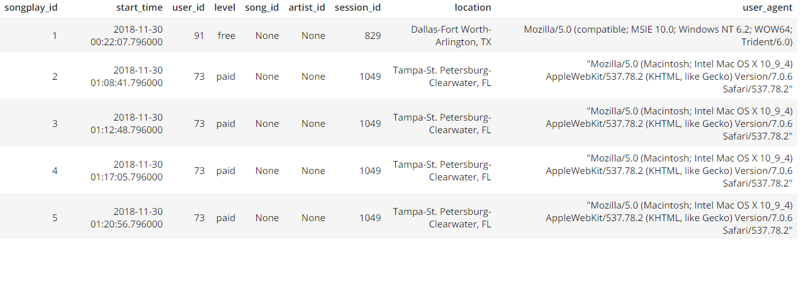

# Project: Data Modeling with Postgres
> by Nikos Zinelis, 8th December 2021

## Introduction
A startup called Sparkify wants to analyze the data they've been collecting on songs and user activity on their new music streaming app. The analytics team is particularly interested in understanding what songs users are listening to. Currently, they don't have an easy way to query their data, which resides in a directory of JSON logs on user activity on the app, as well as a directory with JSON metadata on the songs in their app.

They'd like a data engineer to create a Postgres database with tables designed to optimize queries on song play analysis. Her role is to create a database schema and ETL pipeline for this analysis. She'll be able to test her database and ETL pipeline by running queries given to her by the analytics team from Sparkify and compare her results with their expected results.

## Project Description

In this project, I applied what I've learned on data modeling with Postgres and built an ETL pipeline using Python. To complete the project, I needed to define fact and dimension tables for a star schema for a particular analytic focus, and wrote an ETL pipeline that transfers data from files in two local directories into these tables in Postgres using Python and SQL.

## Database design

Using the song and log datasets, I provided a star schema optimized for fast agregations and simplified queries on song play analysis. This includes one fact table of **songplays** and four dimension tables for **users, songs, artists, and time**:

##### Fact Table
1.**songplays** - records in log data associated with song plays i.e. records with page ***NextSong***  
- songplay_id, start_time, user_id, level, song_id, artist_id, session_id, location, user_agent  

##### Dimension Tables
2.**users** - users in the app
- user_id, first_name, last_name, gender, level

3.**songs** - songs in music database  
- song_id, title, artist_id, year, duration  

4.**artists** - artists in music database  
-  artist_id, name, location, latitude, longitude  

5.**time** - timestamps of records in songplays broken down into specific units  
- start_time, hour, day, week, month, year, weekday  

## ETL Process

Extract data from files in two directories:
- /data/log_data and 
- /data/song_data
and transform, load (ETL) in afforementioned database schema.

#### Song Dataset

The first dataset is a subset of real data from the [Million Song Dataset](http://millionsongdataset.com/). Each file is in JSON format and contains metadata about a song and the artist of that song. The files are partitioned by the first three letters of each song's track ID. For example, here are filepaths to two files in this dataset:

`song_data/A/B/C/TRABCEI128F424C983.json`
`song_data/A/A/B/TRAABJL12903CDCF1A.json`

And below is an example of what a single song file, TRAABJL12903CDCF1A.json, looks like.

`{"num_songs": 1, "artist_id": "ARJIE2Y1187B994AB7", "artist_latitude": null, "artist_longitude": null, "artist_location": "", "artist_name": "Line Renaud", "song_id": "SOUPIRU12A6D4FA1E1", "title": "Der Kleine Dompfaff", "duration": 152.92036, "year": 0}`

#### Log Dataset

The second dataset consists of log files in JSON format generated by this [event simulator](https://github.com/Interana/eventsim) based on the songs in the dataset above. These simulate activity logs from a music streaming app based on specified configurations.

The log files in the dataset I was working with are partitioned by year and month. For example, here are filepaths to two files in this dataset:

`log_data/2018/11/2018-11-12-events.json`
`log_data/2018/11/2018-11-13-events.json`

And below is an example of what the data in a log file, 2018-11-12-events.json, looks like:

## Project Repository files

In addition to the data files, the project includes six files:

1. `test.ipynb` displays the first few rows of each table to let me check my database.
2. `create_tables.py` drops and creates tables. I run this file to reset my tables before each time I run the ETL scripts.
3. `etl.ipynb` reads and processes a single file from song_data and log_data and loads the data into the tables. This notebook contains detailed instructions on the ETL process for each of the tables.
4. `etl.py` reads and processes files from song_data and log_data and loads them into the tables. It's based on my work in the ETL notebook.
4. `sql_queries.py` contains all my sql queries, and is imported into the last three files above.
5. `README.md` then provides an introduction to this project.

## How To Run the Project

##### Build ETL Processes
Follow instructions in the **etl.ipynb** notebook to develop ETL processes for each table. At the end of each table section, or at the end of the notebook, run **test.ipynb** to confirm that records were successfully inserted into each table. Remember to rerun **create_tables.py** to reset your tables before each time you run this notebook.  

##### Build ETL Pipeline
Use what you've completed in **etl.ipynb** to complete **etl.py**, where you'll process the entire datasets from the song_data and log_data directories, and loads them into the sparkifydb database tables. Remember to run **create_tables.py** before running **etl.py** to reset your tables. Run **test.ipynb** to confirm your records were successfully inserted into each table.

## Example queries and results for song play analysis.

Get the number of paid and free plans by gender:  
`%sql SELECT * FROM songplays LIMIT 5`

